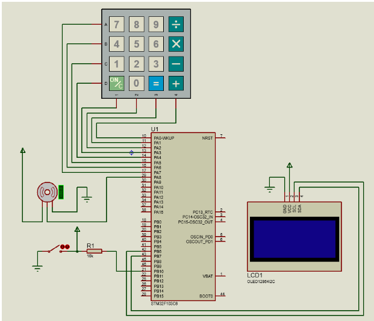

# Khóa cửa có mật mã
GVHD: TS. Nguyễn Đức Tiến
Thành viên:
- Trần Thanh Hải - 20200195
- Vũ Anh Đức - 20200181

[Video demo sản phẩm](https://drive.google.com/file/d/1-BmeEPMhK24aVBD6jCMZrqEnXhMP8O_-/view?usp=sharing)

## Phần cứng
- Chip STM32F103C8T6
- Đầu nạp ST-Link v2
- Servo micro SG90
- Bàn phím ma trận mềm
- Màn hình Oled 0.96 I2C
- Nút ngắt

## Phần mềm sử dụng
- Keil C: Build và nạp code
- STM32CubeMX: cung cấp UI để config các cổng

## Sơ đồ ghép nối thiết bị

## Thư viện
- fonts.h: font chữ
- ssd1306.h: màn hình

## Thuật chạy:

- Sau khi cấp nguồn, người dùng khởi tạo mật khẩu và mật khẩu cấp 2 từ bàn phím
- Người dùng nhập mật khẩu:
  - Nếu mật khẩu đúng: 
    - Servo quay một góc 90 (mở khóa)
    - Bấm nút ngắt để servo quay lại vị trí ban đầu
  - Nếu sai quá 5 lần:
    - Chờ 10s 
    - Sau 10s chờ, nếu nhập đúng mật khẩu, cần nhập thêm mật khẩu cấp 2
  
